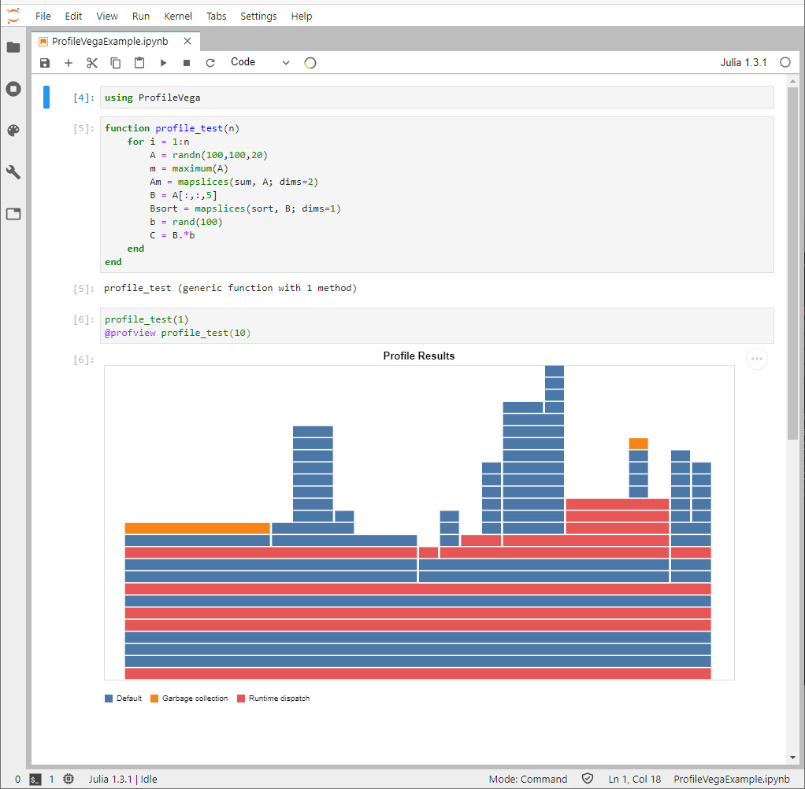
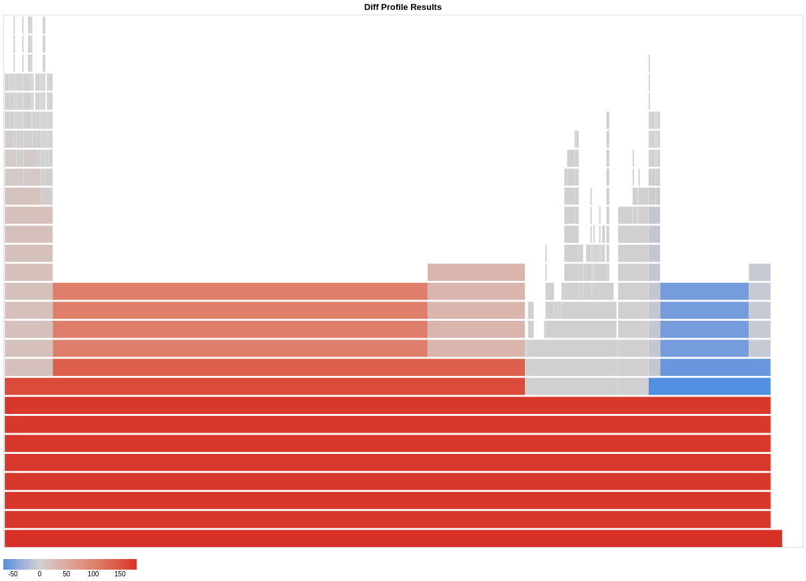
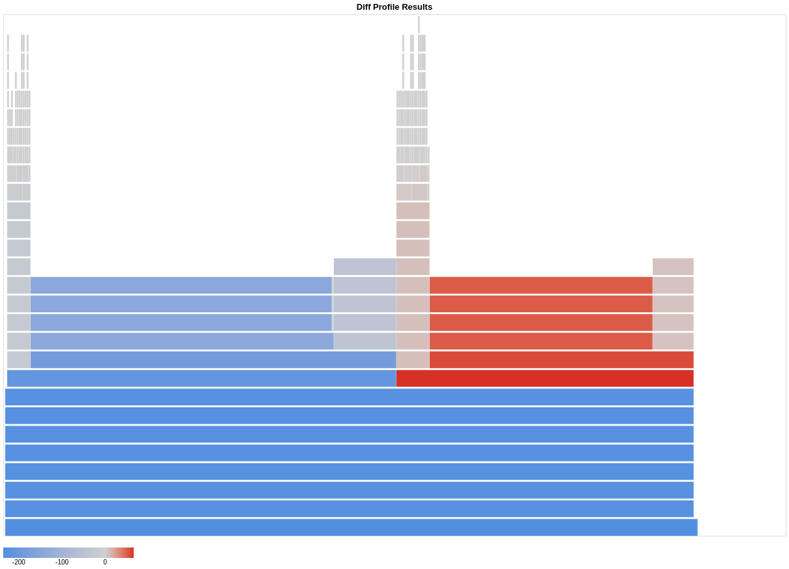

# ProfileVega

[](http://www.repostatus.org/#active)

[](https://codecov.io/gh/davidanthoff/ProfileVega.jl)


## Overview

ProfileVega allows you to export profiling data as a
[VegaLite.jl](https://github.com/queryverse/VegaLite.jl) figure. These
figures can be displayed in Jupyter/IJulia notebooks, or any other
figure display. It is essentially just an "export" package built on top of
[FlameGraphs](https://github.com/timholy/FlameGraphs.jl).

An alternative visualization package is the GTK-based
[ProfileView](https://github.com/timholy/ProfileView.jl).

Among the Julia packages, [ProfileView](https://github.com/timholy/ProfileView.jl)
currently has the most comprehensive tutorial on how to interpret a flame graph.

## Usage

### Usage in Jupyter

```julia
using ProfileVega
@profview f(args...)
```

where `f(args...)` is the operation you want to profile.
`@profview f(args...)` is just shorthand for

```julia
Profile.clear()
@profile f(args...)
ProfileVega.view()
```

If you've already collected profiling data with `@profile`, you can just call `ProfileVega.view()` directly.

The following screenshot illustrates Jupyter usage on a demonstration function `profile_test`:



You can hover over individual blocks in the flame graph to get more detailed information.

You can pan the picture via drag and drop, and zoom via your mouse wheel.

You can adjust the size of the picture by passing `width` and `height` arguments

```julia
@profview f(args...) width = 800 height = 600

# or alternatively
Profile.clear()
@profile f(args...)
ProfileVega.view(width = 800, height = 600)
```

Size parameters can also be set globally

```julia
ProfileView.set_default_size(800, 600)
```

### Exporting figures

Even if you don't use Jupyter, you might want to export a flame graph as
a file as a convenient way to share the results with others. You can export
flame graphs created with this package as PNG, SVG, PDF, vega or vega-lite
files.

Here's a demonstration:

```julia
function profile_test(n)
    for i = 1:n
        A = randn(100,100,20)
        m = maximum(A)
        Am = mapslices(sum, A; dims=2)
        B = A[:,:,5]
        Bsort = mapslices(sort, B; dims=1)
        b = rand(100)
        C = B.*b
    end
end

profile_test(1)   # run once to compile

using Profile, ProfileVega
Profile.clear()
@profile profile_test(10);

# Save a graph that looks like the Jupyter example above
ProfileVega.view() |> save("prof.svg")
```

### Differential Flame Graphs
Differential flame graphs based on [Brendan Gregg](http://www.brendangregg.com/blog/2014-11-09/differential-flame-graphs.html) blog post and is a useful tool for comparison code before and after changes. It works like this

* Take `baseline` stack profile.
* Take `target` stack profile.
* Generate a flame graph using target. (This sets the width of all frames using target profile)
* Colorize the flame graph using the "target - baseline" delta. If a frame appeared more times in 2, it is red, less times, it is blue. The saturation is relative to the delta.

The intent is for use with before & after profiles, such as for non-regression testing or benchmarking code changes.

Here is a demonstration:

```julia
function f1(n)
    res = 0
    for _ in 1:n
        res += sum(rand(10_000))
    end

    for _ in 1:n
        res -= sum(rand(10_000))
    end
    res
end

function f2(n)
    res = 0
    for _ in 1:n
        res += sum(rand(20_000))
    end

    for _ in 1:n
        A = randn(10, 10, 10)
        res += maximum(A)
    end

    for _ in 1:n
        res -= sum(rand(5_000))
    end
    res
end

f1(1) # run once to compile
f2(1) # run once to compile

using ProfileVega
baseline = @profbase f1(10000);
@profdiffview baseline f2(10000)
```

Results are shown on the following screenshot



As it can be seen generally it took longer to execute function `f2`. Most of this increased time is due to
the first `sum(rand(20_000))` cycle as expected, on the other hand second cycle `sum(rand(5_000))` took less
time to execute and therefore shown in blue. In the middle between these two cycles new node appeared which corresponds
to the second cycle. Since there is nothing to compare to it is shown in gray.

Sometimes it is useful to compare baseline graph versus new benchmarks. ONe can use `negate` keyword for that

```julia
@profdiffview baseline f2(10000) negate = true
```

with the following result


